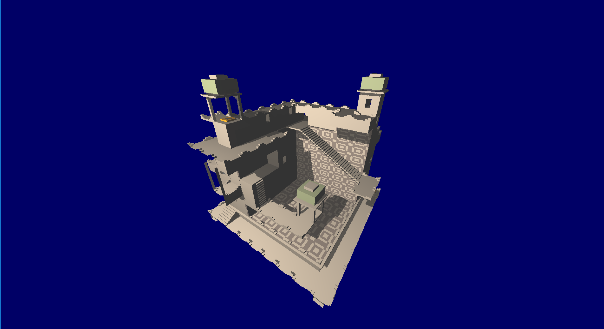

# OpenGL starting point

This was written in the summer of 2016(?), with the goal of getting a rendering pipeline, as well as effect generators, set up, such that a demo for Solskogen 2017 would be possible.

As we can see, this is not something that happened. However, it is still a working C# application which renders simple 3d scenes with rendered shadows. I wrote a shitty magica voxel file format interpreter(allthough i blame the magica voxel file format for not being written with speed in mind), which can load and render some magica voxel models. 

I attached a magica voxel scene i made, densha.vox, which does not parse at the time of committing in late 2018. The code is long gone from my memory and i have no time to maintain this at the moment, so i will leave making the parser parse it an exercise for the reader :).

## How to make it run

Open it in Visual studio, and download required packets from NuGet.

## Platform

OpenGL via OpenTK on C#.

## Credits

I attached a few of the default magica voxel models, as i tested with them when i wrote this program, and it seems that newer versions of magica voxel generates incompatible models :(. These are of course property of ephtracy, whom i stole them from without permission. They are just there to test the magica voxel import code, but i can remove them if needed.

## Thanks etc

Thank you to everyone who i have pestered to get into OpenGL, Especially Duckers^Outracks, who gave me my first opengl starterkit, which inspired me to release this project i found in my archives.